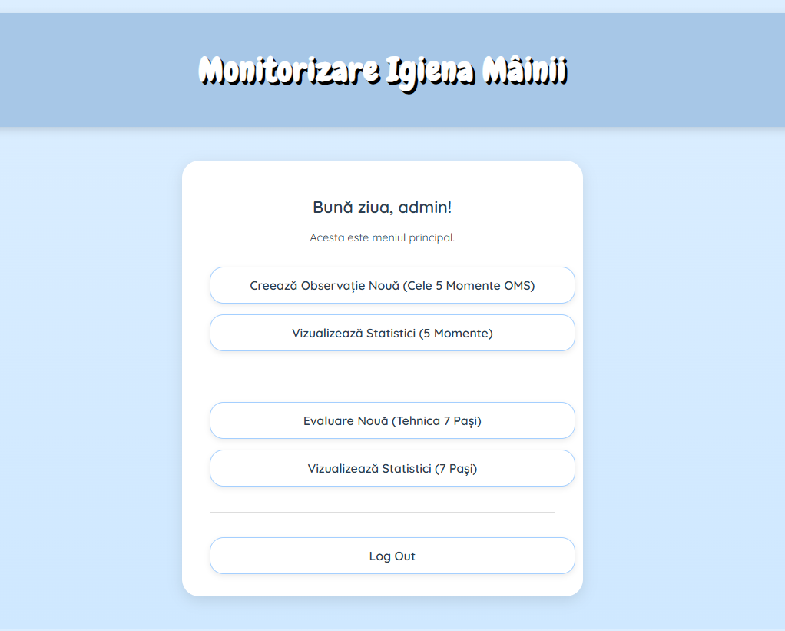
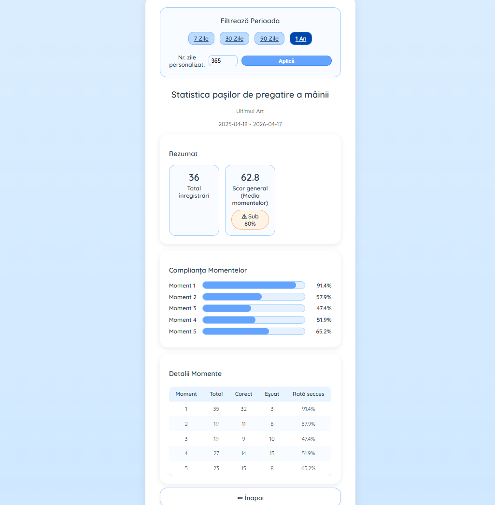
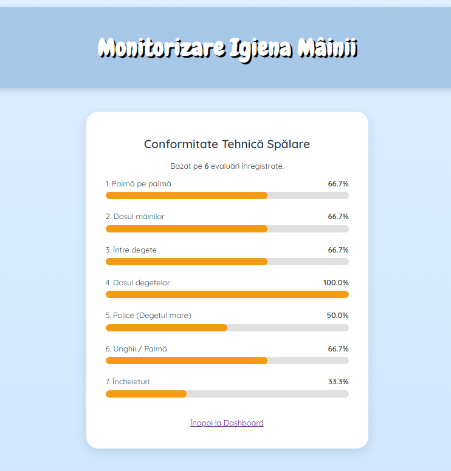
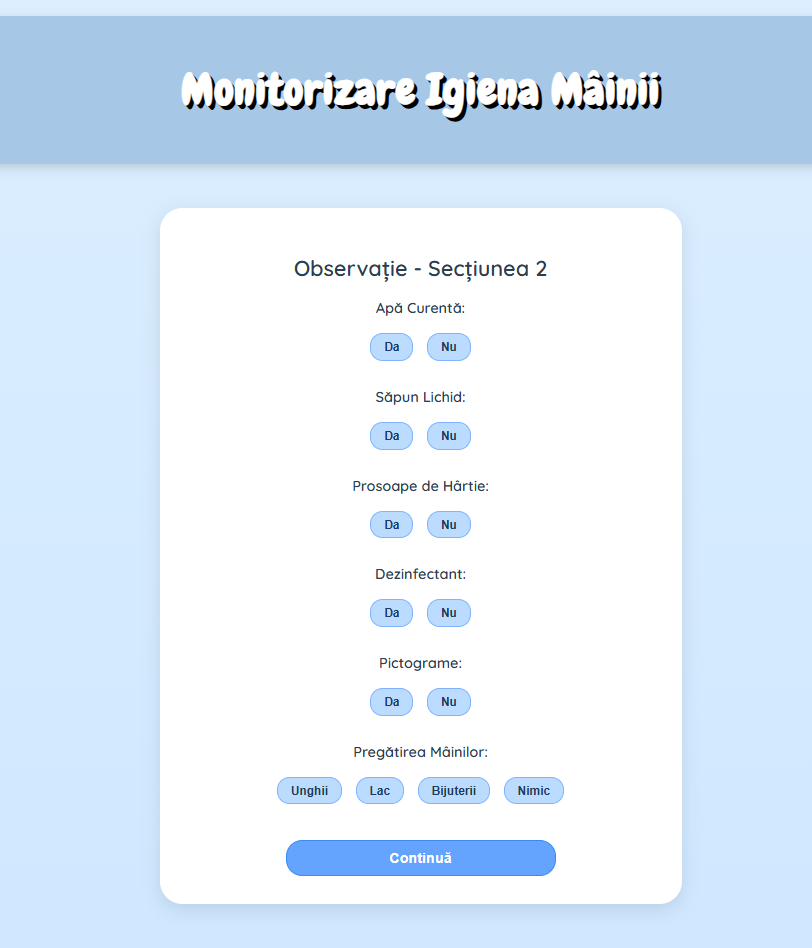
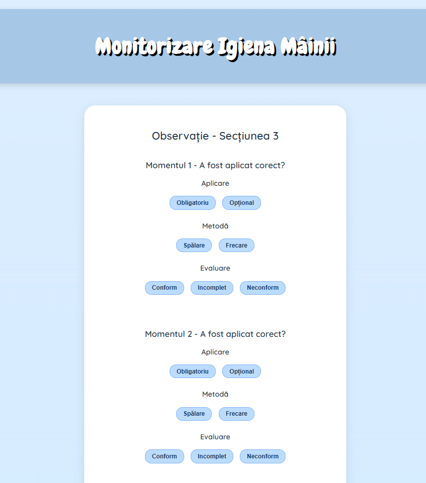
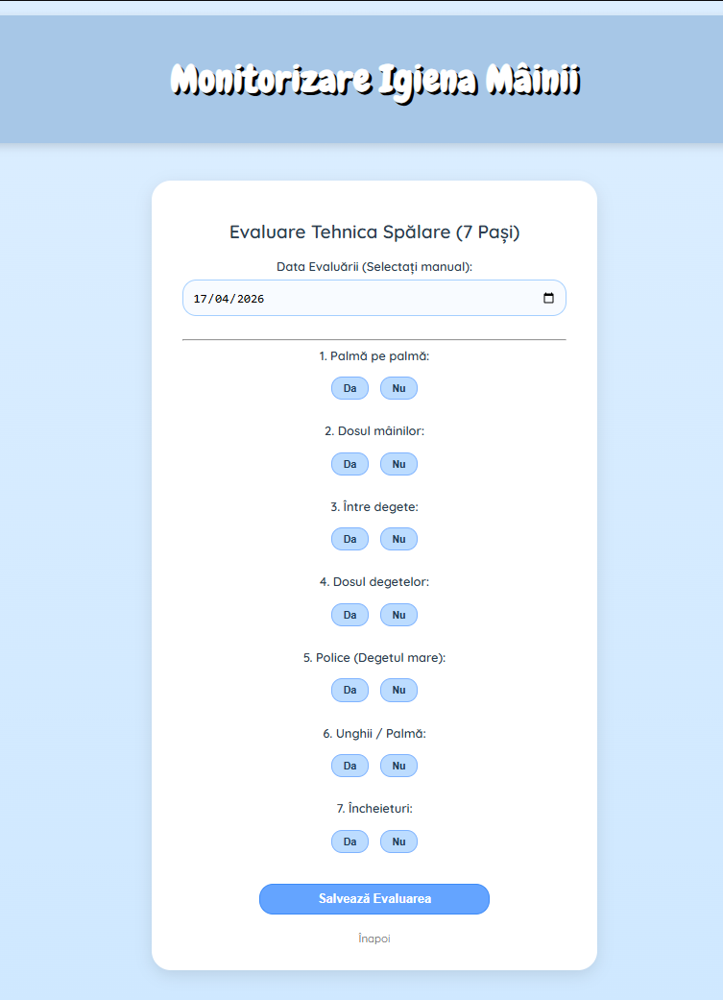
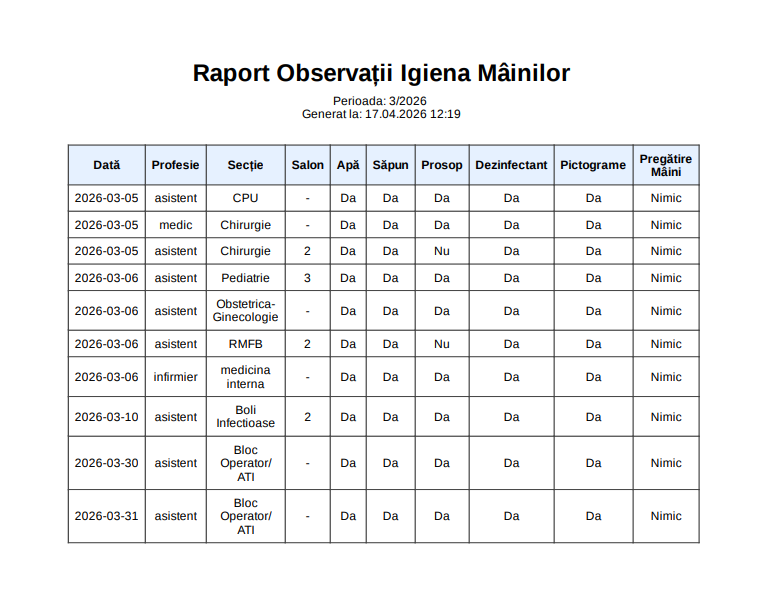

# Automated Clinical Audit & Hand Hygiene Analytics System

A sophisticated full-stack healthcare platform engineered to digitize clinical hygiene monitoring and provide real-time compliance analytics. This system implements the World Health Organization (WHO) "5 Moments" framework, transitioning healthcare environments from legacy paper-based auditing to a secure, cloud-native data architecture.

## Technical Architecture & Engineering

### **Backend & API Design**
* **Asynchronous Execution:** Leveraged **FastAPI** to build high-concurrency endpoints, utilizing Python’s `asyncio` for non-blocking I/O operations.
* **Clean Architecture:** Implemented a modular directory structure separating business logic, database models, and server-side templates to ensure maintainability.
* **Session Management:** Developed custom session-based authentication utilizing **Starlette Middleware** and **Bcrypt** hashing to secure sensitive clinical data.

### **Data Persistence & Modeling**
* **Relational Mapping:** Designed a robust schema using **SQLAlchemy** to manage complex one-to-many relationships between Users, Observations, and Technical Surveys.
* **Database Hosting:** Integrated a **PostgreSQL** instance via **Supabase**, configuring connection pooling and SSL-enforced queries for enterprise-grade security.
* **Dynamic Migrations:** Engineered an automated database initialization sequence that handles table creation and admin bootstrapping on service startup.

### **Analytics & Reporting Engine**
* **Statistical Aggregation:** Programmed complex SQL-based logic to calculate compliance rates, success-to-failure ratios, and "Good Hospital" status indicators across custom time windows (7–365 days).
* **Document Automation:** Integrated the **WeasyPrint** rendering engine to programmatically generate Monthly Resource Reports in PDF format, mapping dynamic Jinja2 templates to professional documentation.

### **DevOps & Cloud Integration**
* **I/CD Pipeline:** Orchestrated deployment on **Render** using a custom Bash build script (`render_build.sh`) to automate environment-specific dependency resolution.
* **Production Web Server:** Configured **Gunicorn** with **Uvicorn workers** to provide a stable, production-grade WSGI/ASGI interface.

## Key Modules
* **`main.py`**: Centralized routing and middleware configuration.
*  **`models.py`**: Declarative SQLAlchemy models for relational integrity.
* **`authentification.py`**: Security layer managing password salting and hashing protocols.
*  **`statistics`**: Business logic for hygiene compliance scoring and trend analysis.

---

## System Modules & Clinical Analytics

### Application Hub

  

  <em>Main entry point showcasing a modular UI designed for rapid clinical navigation.</em>

### Compliance Dashboards (Results)

  
  

  <em>Automated data aggregation engines calculating compliance thresholds and trend analysis.</em>

### Clinical Data Acquisition (The Process)

  
  
  

  <em>Optimized data-entry pipelines featuring server-side validation and responsive UX.</em>

### Professional Reporting

  

  <em>Enterprise reporting module transforming relational SQL data into portable PDF documentation via WeasyPrint.</em>

